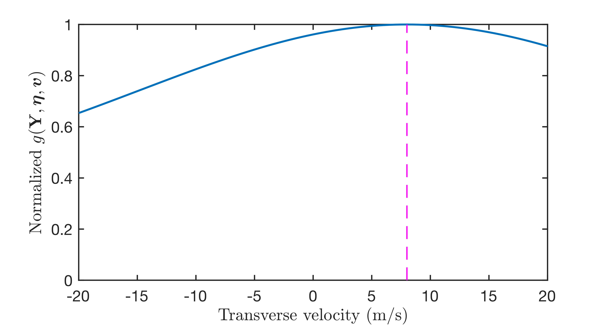
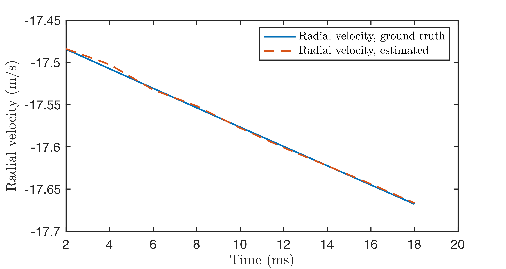
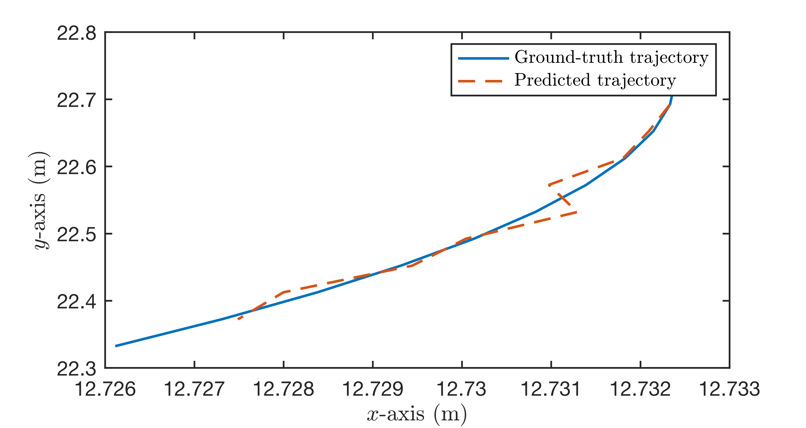
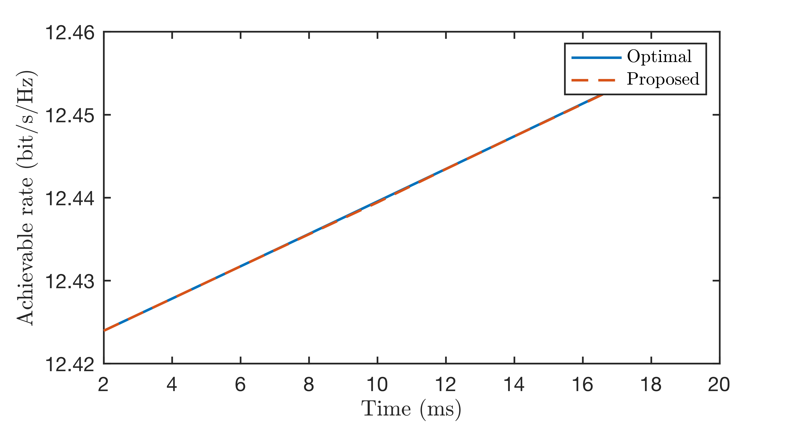

# Near-Field Velocity Sensing and Predictive Beamforming

<span style="color:red">**The updated version of the codes will be released soon.** text</span>

The code for the paper 

**Z. Wang, X. Mu, and Y. Liu, “Near-Field Velocity Sensing and Predictive Beamforming,” *arXiv preprint arXiv:2311.09888*, 2023** [[Arxiv](https://arxiv.org/abs/2311.09888)]

Abstract: 
The novel concept of near-field velocity sensing is proposed. In contrast to far-field velocity sensing, near-field velocity sensing enables the simultaneous estimation of both radial and transverse velocities of a moving target. A maximum-
likelihood-based method is proposed for jointly estimating the radial and transverse velocities from the echo signals. Assisted by near-field velocity sensing, a predictive beamforming framework is proposed for a moving communication user, which requires no channel estimation but achieves seamless data transmission. Finally, numerical examples validate the proposed approaches.

## Running the simulations

### Prerequisites

- [MATLAB 2023b](https://uk.mathworks.com/products/matlab.html)

### Launch

Run `Fig_2.m` for plotting Fig. 2 in this paper.

Run `predictive_beamforming.m` for plotting Fig. 3, Fig. 4, and Fig. 5 in this paper.

### Expected Results

#### Performance of near-field velocity sensing.



#### Performance of predictive beamforming.





## Citing
If you in any way use this code for research, please cite our original article listed above. The corresponding BiBTeX citation is given below:
```
@article{wang2023near,
  title={Near-Field Velocity Sensing and Predictive Beamforming},
  author={Wang, Zhaolin and Mu, Xidong and Liu, Yuanwei},
  journal={arXiv preprint arXiv:2311.09888},
  year={2023}
}
```
